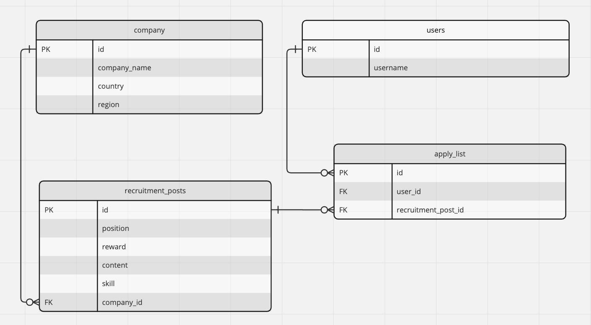

# wanted-pre-onboarding-backend
## [요구사항 분석 및 구현 과정] 
### 1. 채용공고 등록
   - JpaRepository의 save 메서드를 사용하여 DB(recruitment_post)에 등록
   - 회사id를 request로 받아 company와 recruitment_post의 연관관계 매핑
### 2. 채용공고 수정
   - @Transactional을 사용하여 수정
   - setter를 사용하여 DB 수정 -> @Setter를 사용하지않고 필요한 필드만 set메서드 생성
### 3. 채용공고 삭제
   - @Transactional을 사용
   - JpaRepository의 delete 메서드 사용하여 DB(recruitment_post)에서 삭제
### 4. 채용공고 목록
   - Spring Data JPA의 쿼리메서드 사용 : findAll() 사용
   - stream을 사용하여 dto 형식 및 List로 변경
### 5. 채용공고 목록조회 - 조건검색기능
   - QueryDSL을 사용하여 검색기능 구현 : searchRecruitmentPost 메서드 생성
   - contains메서드를 사용하여 keyword가 포함되어있는지를 검사하여 어떤 필드에서든 keyword가 포함되어 있는 경우 해당하는 채용 공고를 조회할 수 있음
### 6. 채용 상세페이지
   - 해당 회사가 올린 다른 채용공고 리스트 : findAllByCompany() 쿼리메서드 작성하고 stream을 이용하여 채용공고_id만 나타낸 List 구현
### 7. 사용자의 채용공고 지원
   - JpaRepository의 save 메서드를 사용하여 DB(recruitment_apply)에 등록
   - 채용공고_id와 사용자_id를 request로 받아 recruitment_post, company를 recruitment_apply와 연관관계 매핑

## [ERD]

